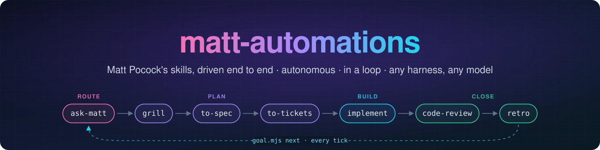

<p align="center">
  
</p>

<p align="center">
  <a href="https://github.com/PyModel/matt-automation/actions/workflows/test.yml"></a>
  <a href="https://github.com/mattpocock/skills"></a>
  
  
  
  
</p>

<p align="center">
  Give it an objective, walk away, come back to reviewed commits on a branch.<br>
  Every run is routed by <code>ask-matt</code>, then driven through Matt's own skills with no human in the loop.
</p>

---

## ✨ What's inside

| | Path | What it does |
|---|---|---|
| 🎯 | [`to-auto/`](to-auto/SKILL.md) | The pipeline: **ask-matt → on-ramp → research → grill → spec → tickets → build → review → retro**. |
| 🐛 | [`to-bug/`](to-bug/SKILL.md) | `to-auto` with the route pinned to `diagnosing-bugs` and the bug fast path armed. |
| 🌱 | [`to-new/`](to-new/SKILL.md) | `to-auto` for a greenfield repo, package, service, or skill. |
| 🛰️ | [`to-orc/`](to-orc/SKILL.md) | Delegation-only orchestrator: pi workers on any model, gated evidence, a raw-JSON verdict. Also `to-auto`'s optional pi implementer backend. |
| 📌 | `vendor/mattpocock-skills/` | Upstream Matt skills as a git submodule, pinned to one commit. |
| 🔗 | `matt/<name>` | Committed symlinks into the submodule: the only place runs load Matt skills from. |
| ⚙️ | [`scripts/`](scripts) | `matt.mjs` resolves and checks skills; `goal.mjs` owns resumption, tickets, claims, and locks. |

## 🚀 Quick start

```sh
git clone --recurse-submodules git@github.com:PyModel/matt-automation.git
cd matt-automation
node scripts/matt.mjs check        # prints "ok"
```

Symlink `to-auto`, `to-bug`, `to-new` and `to-orc` into your harness's skills directory (for example `~/.agents/skills/` or `~/.claude/skills/`), then:

```text
/to-auto add rate limiting to the public API
/loop /to-auto add rate limiting to the public API   # or any recurring runner
```

A run also needs four installed skills: `kun`, `research-stack`, `defensive-design`, `zero-tech-debt`. They are found in `$AGENT_SKILL_HOMES` (path-separated), else `~/.claude/skills` and `~/.agents/skills`; `check` names any that are missing.

## 🔁 How a run works

1. **Route.** Stage `00` runs the wiring check and reads `ask-matt`; `to-auto/FLOWS.md` adds only the autonomy rules on top of its map.
2. **Resume anywhere.** Every invocation, first run or fiftieth loop tick, asks `goal.mjs next <slug>` where it stands. A ticked stage whose artifact is missing is not trusted.
3. **Build in parallel.** Tickets carry file claims and a capability tier; `goal.mjs take` hands out the frontier under a lock, and each ticket runs in its own worktree, on a subagent or a pi worker.
4. **Contract in, receipt out.** Each implementer gets one compiled contract and returns one JSON receipt; `goal.mjs receipt` checks it against git and the ticket before anything merges ([`to-auto/CONTRACT.md`](to-auto/CONTRACT.md)). An objective that already names an agent-ready spec or ticket skips straight to tickets.
5. **Halt cleanly.** Every stop, yours or the run's own, goes through `goal.mjs stop`; `goal.mjs resume` picks up after you fix the cause.

## 🧰 Commands

```sh
node scripts/matt.mjs resolve ask-matt   # SKILL.md path a run loads
node scripts/matt.mjs check              # wiring + installed skills; prints pin and drift
node scripts/matt.mjs link               # regenerate matt/ after the pin moves
node scripts/goal.mjs next <slug>        # where a run resumes
node scripts/goal.mjs frontier <feature> # ticket grammar, frontier, overlapping claims, capabilities
node scripts/goal.mjs receipt <file> --worktree <wt> --base <sha> --ticket <ticket.md>  # gate a receipt
npm test                                 # unit tests · to-orc selftest · adversarial audit
```

## 📌 Bumping the Matt pin

```sh
git -C vendor/mattpocock-skills fetch && git -C vendor/mattpocock-skills checkout origin/main
node scripts/matt.mjs link && node scripts/matt.mjs check
```

A failing `check` means an upstream skill is new or renamed: give it a row in [`to-auto/INTEGRATION.md`](to-auto/INTEGRATION.md) (what the pipeline does with it, or `not used` and why), re-read [`to-auto/PITFALLS.md`](to-auto/PITFALLS.md), and commit the submodule, `matt/` and docs together.
